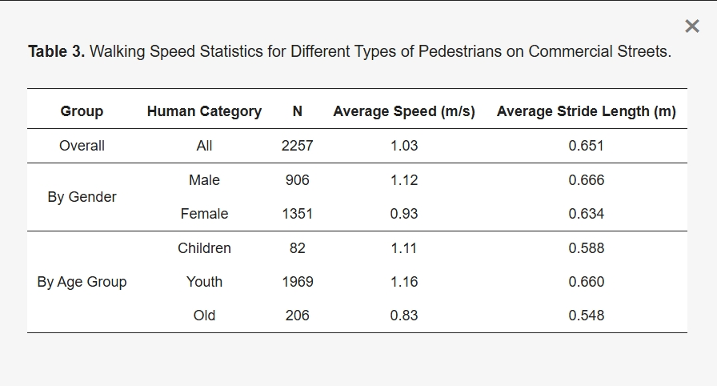

# weekly progress
- date      : 18/04 - 
- labo      : Urban and Transportation Planning
- progress overview : application on modified/enhanced/improved social force model

## Table of contents
- [Recent update on social force model](#recent-update-on-social-force-model)
    - [Development of the social force model considering pedestrian characteristic and behavior](#development-of-the-social-force-model-considering-pedestrian-characteristic-and-behavior)
    - [Simulating of pedestrian grouping and avoidance behavior using an enhanced social force model](#simulating-of-pedestrian-grouping-and-avoidance-behavior-using-an-enhanced-social-force-model)
    - [Exploring the complexity of pedestrian dynamics: impact of societal behavior and personal attributes in urban environments](#exploring-the-complexity-of-pedestrian-dynamics-impact-of-societal-behavior-and-personal-attributes-in-urban-environments)
- [Notes for new terms](#notes-for-new-terms)
- [Notes for additional content to research proposal](#notes-for-additional-content-to-research-proposal)

## Recent update on social force model

### Development of the social force model considering pedestrian characteristic and behavior

- [Siddhart, S.M.P. and Vedagiri, P., (2018)](https://doi.org/10.1177/0361198118758673) conducted study that aims to modify the existing SFM by introducing a factor to account for the gender of the pedestrian.
- On the other side, [Siddhart, S.M.P. and Vedagiri, P., (2024)](https://doi.org/10.1177/03611981231189744) conducted study that aims to simulate bidirectional pedestrian walking behavior by taking into account various pedestrian characteristics (age, gender, behavior) by introducing a novel pedestrian simulation model: the social force model considering pedestrian characteristics and behavior (SFMPCB).
- **Rationale**: A study from 2018 argued that SFM studies remain underexplored for pedestrian in normal behavior using pedestrian facilities, considering pedestrian characteristics such as age, gender, and so forth, <mark>as SFM usually considered in evacuation situations or panic situations. </mark>
- **Data collection method**: data of the pedestrian movement were collected by using <mark>video recorded at specific segment of pedestrian sidewalk in Mumbai, India</mark> (two video camera).
- A designated/marked segment with 18.6 m length within sidewalk was made to observe pedestrian dynamics located between two bus stops.
- The flow of pedestrian was observed bi-directional from entry 1 and entry 2, as well as another flow from entry 3 and entry 4.
- **Proposed modified SFM** -> modify reaction time, based on gender, in the driving force/acceleration term from original SFM:

$$F_i^0=\frac{\left(v_i^0(t)e_i^0(t)-v_i(t) \right)}{\tau_{m/f}}$$

- In addition, gender factor $\alpha_{m/f}$ is calculated as follow, where $\tau_i$ refers to reaction time of all pedestrians without considering gender:

$$\alpha_{m/f}=\frac{\tau_{m/f}}{\tau_i}$$

- Step: (1) calibrating base SFM considering all pedestrians as a single category; (2) $\tau_{m/f}$ is observed by assuming different reaction times for males and females.

### Simulating of pedestrian grouping and avoidance behavior using an enhanced social force model

- A study from [Zhao X., et.al., 2026](https://doi.org/10.3390/su18020746) aims to develop a simulation methodology that better reflects real pedestrian behavior, improving fidelity across complex scenarios.
- This study proposed the improved model integrates three key mechanisms: <mark>a restricted 120° forward visual field, group-type classification based on social relationships, and an exponentially formulated inter-group repulsive force </mark>.
- **Rationale**: original SFM remains limited to depict real-high density, interactive scenarios -> original SFM often fails to accurately reproduce group coordination and avoidance behaviors.
- **Data collection method**: a video camera positioned on the second floor building (approx 6 m above ground level) which directed to bi-directional straight passage between two gates of the commercial street at Wanda Plaza, Nanchang City (which determined as outdoor ground-level walkway).
- To identify groups of pedestrian, the trajectory process is based on the spatial proximity (interpersonal distance < 1 m) and movement synchrony.
- **Key feature analysis**: 
    - walking speed on commercial streets were obtained by generating trajectories during typicall of peak periods on non-working days.
    - outliers were removed manually.
    - pedestrians were categorized into **age groups** through expert review of video footage.
    - average walking speed -> 1.03 m/s
    - Young adults accounted for the largest proportion of pedestrians
    - 2257 valid samples were obtained.
    - The 2257 trajectories were randomly split into 80% for calibration and 20% for held-out validation.
    

    

- **Enhanced social force model**: 
    - Pedestrian effective binocular vision range is limited at 120 $^o$, meaning that pedestrians can only perceive others within 120 $^o$ sector centered on their walking direction;
    - Improved pairing behavior model-> this study proposed heterogenous form of group pedestrian into the model by varying pedestrian social relationship denoted as $T_g$ 

    |Travel Companion Type|$v_{free}$ (m/s)|$\beta_1$|$\beta_2$|$\beta_3$|$d_0$|$\alpha_1$($^o$)|
    |:----------:|:---------:|:----------:|:----------:|:---------:|:----------:|:-----------:|
    |Friend $T_{gfd}$|1.0~1.2|120|90|60|0.7|75|
    |Partner $T_{gcl}$|0.9~1.1|180|210|45|0.5|90|
    |Family $T_{gfy}$|0.7~1.0|105|240|135|0.9|60|
    |Elderly $T_{ged}$|0.6~0.9|75|180|165|1.0|45|

    

### Exploring the complexity of pedestrian dynamics: impact of societal behavior and personal attributes in urban environments 

## Notes for new terms:

## Notes for additional content to research proposal:

## Future task:

## References
- Siddharth, S. M. P., & Vedagiri, P. (2018). Modeling the Gender Effects of Pedestrians and Calibration of the Modified Social Force Model. Transportation Research Record: Journal of the Transportation Research Board, 2672(31), 1-9.
https://doi.org/10.1177/03611981187586
- Siddharth, S. M. P., & Perumal, V. (2024). Development of the social force model considering pedestrian characteristics and behavior. Transportation research record, 2678(5), 436-450. https://doi.org/10.1177/03611981231189744
- Zhao, X., Li, W., Mo, Z., Xue, Y., & Wu, H. (2026). Simulation of Pedestrian Grouping and Avoidance Behavior Using an Enhanced Social Force Model. Sustainability, 18(2), 746. https://doi.org/10.3390/su18020746
- Rafe, A., & Singleton, P. A. (2025). Exploring the Complexity of Pedestrian Dynamics: Impact of Societal Behaviors and Personal Attributes in Urban Environments. Transportation Research Record: Journal of the Transportation Research Board, 2679(2), 136-160. https://doi.org/10.1177/03611981241260707
